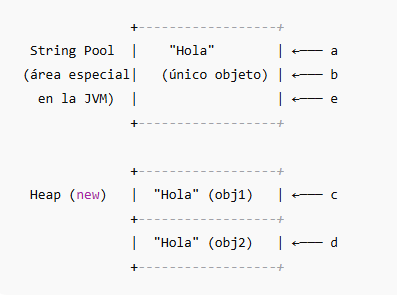

# Object String

### Descripción

Este proyecto de consola muestra ejemplos de uso de Object String en java:

String Literal con String Pool

String con nuevo objeto

Inmutabilidad de String

Problema de concatenación

Uso de StringBuilder

Ejemplo de rendimiento

Uso de StringBuffer

Ejercicio String Pool y Heap

### Requisitos

* Java 17+ (recomendado)
* IDE como IntelliJ, Eclipse o VS Code

ObjectString/\
│── src/\
│ └── Main.java\
│── README.md

### Notas:

* **`String` es inmutable** → cada modificación crea un nuevo objeto.
* **String Pool** → los literales iguales apuntan al mismo objeto (ahorro de memoria).
* **No concatenar con `+` dentro de bucles y fuera de bucles** → ineficiente.
* **Usar `StringBuilder`**  para concatenar (mejor rendimiento en un solo hilo).
* **Usar `StringBuffer`**  para concatenar (si necesitas trabajar con múltiples hilos).

### Ejemplo de Memoria:

```java
String a = "Hola";
String b = "Hola";
String c = new String("Hola");
String d = new String("Hola");
String e = new String("Hola").intern();
```

<figure><figcaption></figcaption></figure>

#### Explicación:

* **a y b** → Apuntan al **mismo objeto `"Hola"` en el String Pool**.
* **c y d** → Cada uno crea un **nuevo objeto en el Heap**, aunque el contenido sea igual.
* **e** → Gracias a `.intern()`, apunta al objeto del **String Pool**, no al Heap.

#### Resumen de comparaciones:

| Expresión     | Resultado | Motivo                                       |
| ------------- | --------- | -------------------------------------------- |
| `a == b`      | `true`    | Ambos apuntan al mismo objeto del pool       |
| `a == c`      | `false`   | `c` es un nuevo objeto en el heap            |
| `c == d`      | `false`   | Cada `new` crea un objeto distinto           |
| `a == e`      | `true`    | `.intern()` fuerza que `e` use el pool       |
| `a.equals(c)` | `true`    | Contenido igual aunque referencias distintas |

#### Consideraciones:

1. **`==`** → compara **referencias** (misma posición en memoria).
2. **`.equals()`** → compara **contenido** de los Strings.
3. **`intern()`** → hace que el String apunte al **String Pool** si ya existe un literal igual.
4. **Concatenaciones** → crean **nuevos objetos** porque los Strings son **inmutables**.

[https://docs.oracle.com/javase/8/docs/api/java/lang/String.html](https://docs.oracle.com/javase/8/docs/api/java/lang/String.html)
